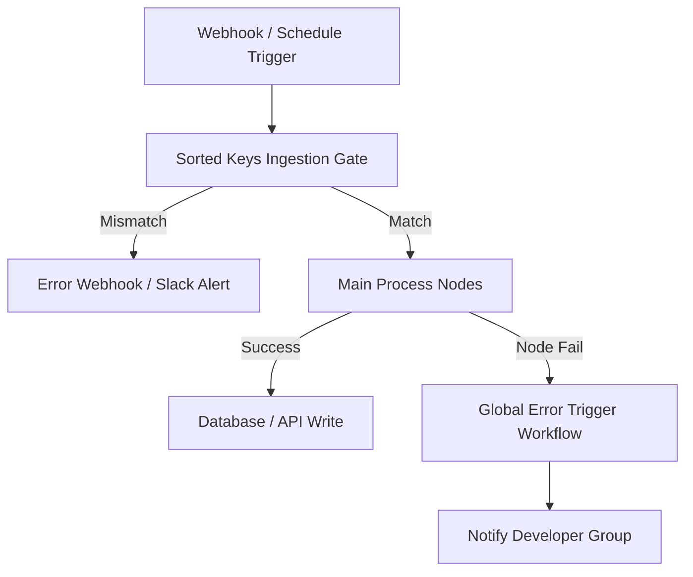

# n8n — Workflow Development & Operations

n8n is a powerful visual workflow engine, but it is vulnerable to database bloat, lost credentials on restart, and unhandled node failures. This skill enforces production-grade n8n deployment and workflow design.

## When to Activate

Use when:
- Configuring or deploying an n8n instance (Docker, Kubernetes, VM)
- Creating or refactoring visual DAG flows in the n8n Editor UI
- Setting up API authentication and node credentials
- Optimizing n8n execution storage and memory footprint
- Writing JavaScript inside Code Nodes in n8n

**Trigger phrases:** "n8n", "n8n server", "n8n credentials", "n8n Code Node", "EXECUTIONS_DATA_PRUNE", "N8N_ENCRYPTION_KEY", "Error Trigger"

## Iron Laws

1. **Never run without a persistent encryption key.** Set `N8N_ENCRYPTION_KEY` to a static, secure key on startup. If left empty, n8n generates a random key on boot; if the container restarts, all credentials will be permanently corrupted.
2. **Prune executions aggressively.** Never leave default retention on high-volume production servers. SQLite and Postgres databases will bloat and stall the system.
3. **Isolate credentials in the UI.** Never paste API keys, passwords, or tokens directly inside HTTP or Code nodes. Use n8n's native credential helper forms.
4. **All workflows must route to a global Error Trigger.** A webhook failure or external API timeout must not stall the pipeline silently.

---

## Instance Configuration (Environment Variables)

Ensure the n8n deployment file (e.g., Docker Compose, Kubernetes values) enforces these variables:

### 1. Database Pruning
```env
# Enable automatic pruning
EXECUTIONS_DATA_PRUNE=true

# Retain execution records for maximum 168 hours (7 days)
EXECUTIONS_DATA_MAX_AGE=168

# Hard cap on stored executions count
EXECUTIONS_DATA_PRUNE_MAX_COUNT=10000

# Save data only on failures to minimize SQLite writes (for high-volume systems)
EXECUTIONS_DATA_SAVE_ON_ERROR=all
EXECUTIONS_DATA_SAVE_ON_SUCCESS=none
```

### 2. Runtime Security
```env
# User permissions: Run as unprivileged node user (UID 1000)
# Network: Restrict UI port exposure behind a reverse proxy (Nginx/Traefik) enforcing HTTPS
# DB Setup: Vacuum SQLite on startup if using file storage
DB_SQLITE_VACUUM_ON_STARTUP=true
```

---

## Workflow Design & Error Handling



### 1. Global Error Workflows
For every active workflow:
1. Create a dedicated **Error Sub-Workflow**.
2. Add the **Error Trigger** node to catch failures.
3. Extract `{{ $error.message }}`, `{{ $workflow.id }}`, and `{{ $execution.id }}`.
4. Output these metadata properties to a system log or Slack/Discord alerts channel.

### 2. Node-Level Retry Policies
For external HTTP requests and database write nodes:
- Enable **Retry on Fail** in the node settings.
- **Base Delay:** 2000ms.
- **Max Retries:** 3.
- Set **Continue on Fail** to `false` for critical transactional writes, forcing escalation to the global error workflow.

---

## Review Checklist

- [ ] **Encryption Key:** Is `N8N_ENCRYPTION_KEY` hardcoded to a persistent config?
- [ ] **Pruning:** Are `EXECUTIONS_DATA_PRUNE` and max age limits set?
- [ ] **No Secrets in Code:** Are credentials isolated from JavaScript Code Nodes and raw HTTP Node body parameters?
- [ ] **Error Trigger:** Is a global error trigger workflow connected and active?
- [ ] **Reverse Proxy:** Is the editor UI restricted behind Traefik/Nginx with TLS active?
