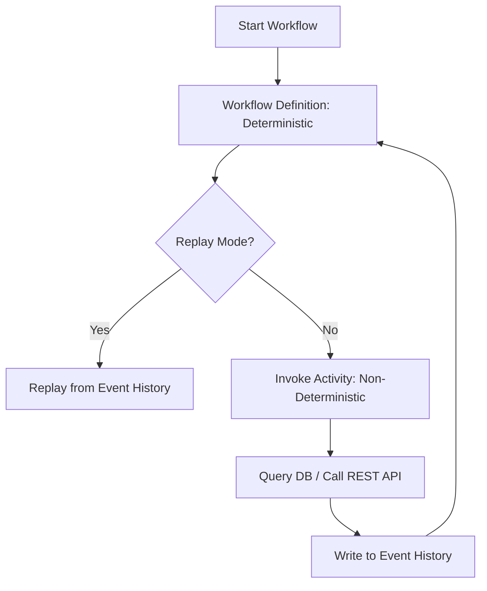

# Temporal.io — Durable Execution & Workflow Design

Temporal.io provides fault-oblivious, stateful orchestration by replaying workflow code. However, minor code modifications, side effects in workflow definitions, or misconfigured timeouts will trigger catastrophic `NonDeterministicWorkflowError` exceptions in production. This skill enforces strict determinism and activity isolation.

## When to Activate

Use when:
- Designing or writing Temporal Workflows or Activities (Go, Python, TypeScript, Java SDKs)
- Configuring Activity timeouts and Retry Policies
- Versioning or patching existing running workflows
- Implementing workers and task queue listening services
- Auditing integration code for replay safety

**Trigger phrases:** "Temporal.io", "Temporal workflow", "Temporal activity", "Worker Versioning", "NonDeterministicWorkflowError", "StartToCloseTimeout", "workflow.Now"

## Iron Laws

1. **Workflows must be strictly deterministic.** Never call external APIs, write to databases, query system clocks (e.g., `time.Now()` or `new Date()`), generate random numbers, or create UUIDs directly inside a workflow. All side effects must reside inside **Activities**.
2. **Never deploy changes to active workflow code without versioning.** Use **Worker Versioning** (recommended) or the SDK's `GetVersion` / `Patch` API to branch code paths for in-flight executions. Modifying a running workflow definition directly breaks replay history.
3. **Always set `StartToCloseTimeout` on Activities.** Never rely solely on `ScheduleToClose`. If a worker dies mid-activity, Temporal needs `StartToCloseTimeout` to detect the crash and reassign the task.
4. **All Activities must be idempotent.** Activities are designed to be retried automatically upon network or server failures. They must handle duplicate executions safely without writing duplicate database rows.

---

## Workflow vs. Activity Boundaries



### 1. Workflow Constraints (Deterministic)
- **Time:** Use SDK-provided time checks (e.g., `workflow.Now(ctx)`) instead of native system clocks.
- **Sleep:** Use `workflow.Sleep(ctx, duration)` instead of system sleep tools (`time.Sleep` / `setTimeout`).
- **Side Effects:** If you must generate a random ID or value in a workflow, wrap it in a `workflow.SideEffect()` or `workflow.ExecuteActivity()`.

### 2. Activity Constraints (Non-Deterministic)
- Activities must perform a **single logical transaction**. Do not combine unrelated database writes into one massive activity; if a failure occurs halfway, reverting is complex.
- **Arguments:** Pass arguments and return values as **objects/structs** rather than primitives. This enables adding new fields later without breaking API signatures.

---

## Timeouts & Retries Setup

When configuring `ActivityOptions`, set the following timeouts:

*   **`StartToCloseTimeout`:** Set to the maximum expected duration of a *single* activity execution attempt (e.g., 30 seconds). Prevents execution hangs if the worker crashes.
*   **`HeartbeatTimeout`:** For activities running longer than a few minutes (e.g., file downloads, data processing), set this timeout and periodically invoke `activity.RecordHeartbeat()` in your code. This lets Temporal catch crashed workers in seconds.
*   **`ScheduleToCloseTimeout`:** Set this to limit the *overall* time of the activity execution, including all retries. This is cleaner than setting a maximum retry count limit.

---

## Workflow Patching & Versioning (Example)

If you must update workflow logic that has active runs in production:

### Go SDK Patching Example
```go
// Legacy: Execute Activity A
// New: Execute Activity B

var version = workflow.GetVersion(ctx, "ChangeActivityTarget", workflow.DefaultVersion, 1)
if version == workflow.DefaultVersion {
    // Old code path
    err := workflow.ExecuteActivity(ctx, ActivityA).Get(ctx, nil)
} else {
    // New code path
    err := workflow.ExecuteActivity(ctx, ActivityB).Get(ctx, nil)
}
```

### TypeScript SDK Patching Example
```typescript
import { patched, getVersion } from '@temporalio/workflow';

// Check if patch is active in history
const version = getVersion('my-patch-id', 1, 2);
if (version === 1) {
  // Old logic
  await ActivityA();
} else {
  // New logic
  await ActivityB();
}
```

---

## Review Checklist

- [ ] **Determinism Check:** Are there any local clocks, random number generators, or network requests in the workflow files?
- [ ] **Side Effects Isolated:** Do all HTTP requests, database writes, and file system tasks reside in Activities?
- [ ] **Timeout Configured:** Is `StartToCloseTimeout` explicitly defined for every activity invocation?
- [ ] **Worker Versioning:** If making code changes to a running workflow, are they protected by `GetVersion`/patching or Worker Versioning tags?
- [ ] **Idempotent Write:** Does the target database table have a unique constraint or transaction check to handle retried activities?
- [ ] **Objects as Parameters:** Are activity inputs and outputs passed as unified JSON objects/structs rather than raw parameters?
