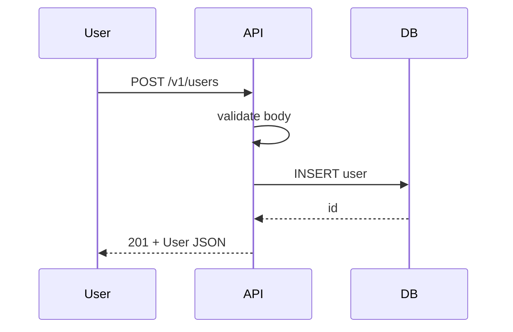

# Documentation

Documentation exists to reduce the cost of the next person (often you, in three months) doing the right thing. It's not marketing copy, it's not a transcript, and it's not optional on anything that crosses a team or a release boundary.

## When to Activate

Use when:
- Initializing a new repo, package, or service (the README is part of "done")
- Shipping a public API, SDK, or CLI that others will integrate against
- Making a non-obvious architectural decision worth recording (an ADR)
- Authoring an on-call runbook for an incident class you've now seen twice
- Preparing a handoff (leaving the project, onboarding a teammate, archiving)
- A reviewer or user asks "how is anyone supposed to know that?"
- Cutting a release with breaking changes (CHANGELOG + migration notes)
- The code did something a future reader couldn't infer from the diff alone

**Trigger phrases:** "write the README", "document this", "API docs", "ADR", "decision record", "runbook", "onboarding", "handoff", "where are the docs", "migration guide", "how do I use X"

## When NOT to Use

| Situation | Use instead |
|---|---|
| Writing a thesis chapter, paper section, or academic prose | `thesis/skill-academic-writing` |
| Removing AI-isms / patterns from prose | `thesis/skill-avoid-ai-writing` |
| Reviewing someone else's documentation for quality | `shared/skill-self-review` (with a docs focus) |
| Writing a literature review | `thesis/skill-literature-review` |
| Drafting OpenAPI / GraphQL schema docs from code | `webdev/skill-api-rest` / `webdev/skill-api-graphql` |
| Test plans, test docs | `shared/skill-testing` |
| ADRs about a security decision | `shared/skill-security` (record the threat model in the ADR) |

This skill is about technical documentation in code repos. Anything else has a better neighbor.

## Iron Laws

1. **Docs live with the code.** Out-of-tree docs rot first; nobody updates them with the PR. Markdown in the repo or auto-generated from source — nothing else.
2. **Every example must run as written.** Untested examples are anti-documentation; readers waste hours on snippets that haven't worked since Python 3.6.
3. **Document the "why," not the "what."** The diff already shows what changed. Docs explain why this approach was chosen, what alternatives were rejected, what assumptions break.
4. **No documentation without a target reader.** "For internal use" is a tell. Name the role: new contributor, on-call engineer, API consumer, future-you.

## Decision Rubric — Which Document?

The single biggest mistake is putting the wrong content in the wrong artifact.

| If the reader needs to… | Write a… | Lives in |
|---|---|---|
| Decide whether to use this project at all | **README** | `/README.md` |
| Get the project running on their machine for the first time | **Quickstart / Getting Started tutorial** | `/docs/getting-started.md` or in-README |
| Accomplish a specific task they already know they need (e.g. "rotate the API key") | **How-to guide** | `/docs/guides/<task>.md` |
| Look up a specific endpoint, flag, function signature | **Reference (API doc)** | Auto-generated, or `/docs/api/` |
| Understand *why* the system is shaped this way | **Explanation / architecture doc** | `/docs/architecture/` |
| Understand a single decision and its trade-offs | **ADR (Architecture Decision Record)** | `/docs/adr/NNNN-<slug>.md` |
| Recover from an incident at 3am | **Runbook** | `/docs/runbooks/<symptom>.md` |
| Migrate from version N to N+1 | **Migration guide + CHANGELOG entry** | `/CHANGELOG.md`, `/docs/migrations/vN-to-vN+1.md` |
| Contribute code | **CONTRIBUTING.md** | `/CONTRIBUTING.md` |

This is the [Diátaxis framework](https://diataxis.fr/) (tutorials, how-tos, reference, explanation) plus operational docs. Mixing these is the most common documentation defect: a "reference" full of tutorial prose, or a "tutorial" that's just a list of every option.

## Diátaxis at a Glance

| | Learning-oriented | Task-oriented |
|---|---|---|
| **Practical (doing)** | **Tutorial** — "follow these steps and you'll have a working X" | **How-to** — "to accomplish Y, do this" |
| **Theoretical (knowing)** | **Explanation** — "why the system works this way" | **Reference** — "every parameter, exhaustively" |

A tutorial is not a how-to: tutorials hold the reader's hand from zero; how-tos assume competence and target one outcome. A reference is not an explanation: references list everything; explanations argue for the design.

## Templates

### README (project entry point)

Length target: one screen on first read; deeper sections below the fold.

```markdown
# <project-name>

<one sentence: what this project does, in concrete terms — not "modern", not "powerful">

<one paragraph: who it's for, what problem it solves, and a *concrete* example of the kind of thing it lets you do>

## Install

​```bash
<the actual install command, copy-pasteable>
​```

## Quickstart

​```<lang>
<the smallest runnable example that produces visible output>
​```

Expected output:
​```
<what the reader should see>
​```

## Documentation

- [Getting Started](docs/getting-started.md) — full walkthrough
- [How-to guides](docs/guides/) — task-oriented recipes
- [Reference](docs/api/) — every API surface
- [Architecture](docs/architecture/) — why it's built this way

## Status

<actively maintained / experimental / archived> · <license>

## Contributing

See [CONTRIBUTING.md](CONTRIBUTING.md).
```

What to leave out of the README: a wall of badges, every config flag, every API method, marketing adjectives, animated GIFs of irrelevant features. Send the reader elsewhere for those.

### ADR (Architecture Decision Record)

Length target: 1–2 pages. ADRs that grow longer are usually trying to explain a *system* — that's an `architecture.md`, not an ADR.

```markdown
# ADR-NNNN: <decision in active voice — "Use Postgres for primary storage", not "Postgres">

- **Status:** Proposed | Accepted | Deprecated | Superseded by ADR-MMMM
- **Date:** YYYY-MM-DD
- **Deciders:** <names or roles>

## Context

<What forces are at play? What problem are we solving? What constraints exist?
This is the section that ages well — it's why future-you will trust the decision.>

## Decision

<We will do X. State it plainly. One paragraph.>

## Alternatives Considered

- **Option A:** <what it was, why we rejected it>
- **Option B:** <what it was, why we rejected it>

## Consequences

- Positive: <what we gain>
- Negative: <what we give up>
- Neutral: <what changes that isn't strictly better or worse>

## References

- <Links to docs, RFCs, prior ADRs, design discussions>
```

ADRs are immutable — superseded, not edited. When the decision changes, write ADR-NNNN+1 that supersedes the old one. The history is the point.

### Runbook (on-call recovery)

Optimized for someone half-awake at 3am. No prose where a checklist will do.

```markdown
# Runbook: <symptom or alert name>

**Severity:** <SEV1 | SEV2 | SEV3>
**Owner:** <team / Slack channel>
**Pager:** <PagerDuty service>

## Symptom

<What does the user / monitor see? Be exact — error code, alert name, dashboard panel.>

## Likely Causes (most common first)

1. <Cause A>
2. <Cause B>
3. <Cause C>

## Diagnosis

​```bash
# 1. Check service health
<exact command>

# 2. Check upstream dependency
<exact command>

# 3. Check recent deploys
<exact command>
​```

What to look for: <specific signal in the output>

## Mitigation

### If <cause A>:
​```bash
<exact remediation>
​```

### If <cause B>:
​```bash
<exact remediation>
​```

## Verification

​```bash
<command that confirms the system is healthy again>
​```

## Escalation

If mitigation does not restore service in <N> minutes, page <person/team>.

## Post-incident

- File an incident ticket: <link>
- Add to `incidents/YYYY-MM-DD-<slug>.md`
```

A runbook that says "investigate the issue" is not a runbook. Every step must be a command or a decision the responder can act on.

### API Reference (per-endpoint)

```markdown
### POST /v1/users

Create a user.

**Auth:** Bearer token, scope `users:write`.

**Request body:**

​```json
{
  "name": "Ada Lovelace",
  "email": "ada@example.com"
}
​```

**Field constraints:**

| Field | Type | Constraint |
|---|---|---|
| `name` | string | 1–80 chars, trimmed |
| `email` | string | RFC 5322; unique across users |

**Responses:**

| Status | Body | When |
|---|---|---|
| 201 Created | `User` | Success |
| 400 Bad Request | `Error` | Body fails validation |
| 409 Conflict | `Error` | Email already in use |
| 429 Too Many Requests | `Error` | Rate limit (100/min/user) |

**Example:**

​```bash
curl -X POST https://api.example.com/v1/users \
  -H "Authorization: Bearer $TOKEN" \
  -H "Content-Type: application/json" \
  -d '{"name":"Ada Lovelace","email":"ada@example.com"}'
​```

**Idempotency:** Not idempotent. Use `Idempotency-Key` header to safely retry.
```

Prefer auto-generation from the schema (OpenAPI, GraphQL introspection, language-native doc tools) over hand-maintained reference. Hand-maintained reference is reference that drifts.

## What Belongs in Code Comments vs. Docs

```python
# DEFECT — comment narrates the code; useless
def calculate_total(items):
    # Loop over items
    total = 0
    for item in items:
        # Add price times quantity
        total += item.price * item.quantity
    return total

# CORRECT — comment justifies a non-obvious choice
def calculate_total(items):
    """Total in cents. We use integer cents (not float dollars) because float
    arithmetic introduces rounding errors that compound over reconciliation
    runs (see ADR-0017)."""
    return sum(item.price_cents * item.quantity for item in items)
```

The rule: comments answer questions the reader can't get from reading the code. "Why this approach?", "What goes wrong if you change this?", "Where else is this assumption made?".

## Common Failure Modes

| Pattern | Why it fails |
|---|---|
| Docs in a wiki / Notion / Confluence outside the repo | Drift starts immediately; PRs don't update them; the wiki becomes a graveyard |
| README that's marketing copy ("blazingly fast", "modern", "elegant") | Tells the reader nothing about whether to use the tool |
| Untested code samples | Snippets break silently across versions; readers blame themselves, file no issue |
| "TODO: document this later" | "Later" never arrives. If it's worth a TODO, write the docs before merging |
| One mega-doc covering tutorial + how-to + reference | Reader can't find what they need; maintainer can't update without a rewrite |
| Auto-generated docs with no narrative | A list of every method is not a manual; readers need an entry point and worked examples |
| Architecture docs with no ADRs | The current shape is documented; the *reasoning* is lost — next team will repeat the mistake |
| Runbook full of "investigate" / "check the logs" | Useless under pressure; runbooks need exact commands, not prose |
| Comments that repeat the code | Increase maintenance cost without adding signal; mislead when code changes and comment doesn't |
| Stale screenshots / GIFs of an old UI | Implies the doc is current when it isn't; readers infer system behavior incorrectly |
| Migration guide for v2 written *during* v1 ("we'll write it when we get there") | You won't remember the migration steps once the changes are made — write them as you go |

## Documentation Review Checklist

Before declaring docs done (yours or a teammate's):

- [ ] Right artifact for the audience — README, ADR, runbook, reference, or how-to (see decision rubric)
- [ ] Every code sample copy-pasteable; tested or auto-validated
- [ ] No marketing adjectives ("powerful", "blazing", "elegant", "best-in-class")
- [ ] Why-decisions captured in ADRs, not buried in commit messages or Slack
- [ ] Public API has reference docs auto-generated from source
- [ ] Runbooks contain exact commands, not "investigate"
- [ ] Breaking changes have a migration guide and CHANGELOG entry
- [ ] Diagrams (if any) are text-based (Mermaid, PlantUML) so they version-control cleanly
- [ ] Links work; no `localhost`, no internal-only paths, no `TODO` placeholders
- [ ] A first-time reader can get to "hello world" in under 5 minutes from the README

## Diagrams That Survive

Use text-based diagram formats so docs review like code. Mermaid is the lowest common denominator.



A binary diagram (Visio, Lucidchart export, screenshot from a whiteboard) drifts the moment the system changes. A Mermaid diagram in a `.md` file gets updated in the same PR as the code.

## Integration

- `thesis/skill-academic-writing` — for thesis chapters / academic prose; this skill is for repo-resident technical docs
- `thesis/skill-avoid-ai-writing` — apply to any doc that another human will read; AI-isms erode trust
- `shared/skill-self-review` — reviewer checks docs as part of "ready to merge"
- `shared/skill-tdd` — example code in docs is testable; treat broken examples as test failures
- `shared/skill-security` — ADRs for auth / secrets / threat-model decisions belong under this skill's templates but follow security's content
- `shared/skill-debugging` — runbooks come from systematic debugging post-mortems
- `shared/skill-finishing-branch` (`webdev/skill-finishing-branch`) — handoff docs and CHANGELOG entries live in the wrap-up
- `webdev/skill-api-rest` / `webdev/skill-api-graphql` — these own the *content* of API docs; this skill owns the *form*
- `webdev/skill-deployment` — runbook templates often live alongside deploy automation

## Resources

- [Diátaxis](https://diataxis.fr/) — the canonical taxonomy used in this skill
- [Architecture Decision Records (Michael Nygard's original post)](https://cognitect.com/blog/2011/11/15/documenting-architecture-decisions)
- [adr-tools](https://github.com/npryce/adr-tools) — CLI for managing ADRs
- [Write the Docs](https://www.writethedocs.org/) — community + guides
- [Google Developer Documentation Style Guide](https://developers.google.com/style)
- [The Art of README](https://github.com/hackergrrl/art-of-readme) — what belongs in a README
- [Keep a Changelog](https://keepachangelog.com/) — the CHANGELOG convention worth using
- [Semantic Versioning](https://semver.org/) — paired with CHANGELOG entries
- [Mermaid](https://mermaid-js.github.io/mermaid/) — text-based diagrams that version-control
