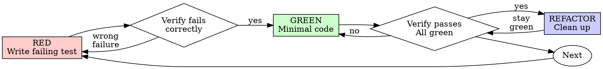

<!-- ADAPTED from D:/skills/community/development/test-driven-development/SKILL.md
     Adaptations: Lattice frontmatter, added When to Activate + Trigger phrases blocks,
     replaced @testing-anti-patterns.md reference with pointer to skill-testing,
     added Integration with Other Skills section. Iron Law, Red-Green-Refactor diagram,
     anti-patterns table, and rationalizations table preserved verbatim. -->
---
name: skill-tdd
description: Test-Driven Development discipline — write the failing test first, watch it fail, then write minimal code to pass. Use when implementing any feature, bug fix, refactor, or behavior change in webdev or ML projects. Iron Law: NO PRODUCTION CODE WITHOUT A FAILING TEST FIRST. Complements skill-testing (which covers what kinds of tests to write); this skill covers the discipline of when and how. Trigger when the user asks to implement, fix, refactor, or change behavior — not just when they say "TDD."
---

# Test-Driven Development (TDD)

## When to Activate

**Always activate for:**
- Implementing a new feature or function
- Fixing a bug
- Refactoring existing code
- Any change in observable behavior
- ML preprocessing or evaluation logic where correctness matters
- Any time `skill-testing` is also activated

**Trigger phrases:**
- "implement", "add", "build", "create function/class/endpoint"
- "fix bug", "fix the issue", "fix this"
- "refactor", "clean up", "rewrite"
- "change how it works", "modify behavior"
- "TDD", "test-first", "test-driven"

**Exceptions (ask the user first):**
- Throwaway prototypes / spikes
- Generated code (scaffolding from a template)
- Configuration files

Thinking "skip TDD just this once"? Stop. That's rationalization.

## Overview

Write the test first. Watch it fail. Write minimal code to pass.

**Core principle:** If you didn't watch the test fail, you don't know if it tests the right thing.

**Violating the letter of the rules is violating the spirit of the rules.**

## The Iron Law

```
NO PRODUCTION CODE WITHOUT A FAILING TEST FIRST
```

Wrote code before the test? Delete it. Start over.

**No exceptions:**
- Don't keep it as "reference"
- Don't "adapt" it while writing tests
- Don't look at it
- Delete means delete

Implement fresh from tests. Period.

## Red-Green-Refactor



### RED — Write Failing Test

Write one minimal test showing what should happen.

**Good:**
```typescript
test('retries failed operations 3 times', async () => {
  let attempts = 0;
  const operation = () => {
    attempts++;
    if (attempts < 3) throw new Error('fail');
    return 'success';
  };

  const result = await retryOperation(operation);

  expect(result).toBe('success');
  expect(attempts).toBe(3);
});
```
Clear name, tests real behavior, one thing.

**Bad:**
```typescript
test('retry works', async () => {
  const mock = jest.fn()
    .mockRejectedValueOnce(new Error())
    .mockRejectedValueOnce(new Error())
    .mockResolvedValueOnce('success');
  await retryOperation(mock);
  expect(mock).toHaveBeenCalledTimes(3);
});
```
Vague name, tests the mock not the code.

**Requirements:**
- One behavior
- Clear name
- Real code (no mocks unless unavoidable)

### Verify RED — Watch It Fail

**MANDATORY. Never skip.**

```bash
npm test path/to/test.test.ts
# or pytest path/to/test_file.py::test_name
```

Confirm:
- Test fails (not errors)
- Failure message is the expected one
- Fails because the feature is missing (not because of typos or import errors)

**Test passes immediately?** You're testing existing behavior. Fix the test.

**Test errors?** Fix the error, re-run until it fails correctly.

### GREEN — Minimal Code

Write the simplest code that makes the test pass.

**Good:**
```typescript
async function retryOperation<T>(fn: () => Promise<T>): Promise<T> {
  for (let i = 0; i < 3; i++) {
    try {
      return await fn();
    } catch (e) {
      if (i === 2) throw e;
    }
  }
  throw new Error('unreachable');
}
```
Just enough to pass.

**Bad:**
```typescript
async function retryOperation<T>(
  fn: () => Promise<T>,
  options?: {
    maxRetries?: number;
    backoff?: 'linear' | 'exponential';
    onRetry?: (attempt: number) => void;
  }
): Promise<T> {
  // YAGNI
}
```
Over-engineered. Add features when a future test requires them.

Don't add features, refactor unrelated code, or "improve" beyond what the test requires.

### Verify GREEN — Watch It Pass

**MANDATORY.**

```bash
npm test path/to/test.test.ts
```

Confirm:
- Test passes
- Other tests still pass
- Output is pristine (no errors, no warnings)

**Test fails?** Fix the code, not the test.

**Other tests fail?** Fix them now — don't move on with a broken suite.

### REFACTOR — Clean Up

After green only:
- Remove duplication
- Improve names
- Extract helpers

Keep tests green. Don't add behavior.

### Repeat

Next failing test for the next behavior.

## Good Tests

| Quality | Good | Bad |
|---------|------|-----|
| **Minimal** | One thing. "and" in name? Split it. | `test('validates email and domain and whitespace')` |
| **Clear** | Name describes behavior | `test('test1')` |
| **Shows intent** | Demonstrates desired API | Obscures what code should do |

## Why Order Matters

**"I'll write tests after to verify it works"**

Tests written after code pass immediately. Passing immediately proves nothing:
- Might test the wrong thing
- Might test implementation, not behavior
- Might miss edge cases you forgot
- You never saw it catch a bug

Test-first forces you to see the test fail, proving it actually tests something.

**"I already manually tested all the edge cases"**

Manual testing is ad-hoc. You think you tested everything but:
- No record of what you tested
- Can't re-run when code changes
- Easy to forget cases under pressure
- "It worked when I tried it" ≠ comprehensive

Automated tests are systematic. They run the same way every time.

**"Deleting X hours of work is wasteful"**

Sunk cost fallacy. The time is already gone. Your choice now:
- Delete and rewrite with TDD (X more hours, high confidence)
- Keep it and add tests after (30 min, low confidence, likely bugs)

The "waste" is keeping code you can't trust.

**"TDD is dogmatic, being pragmatic means adapting"**

TDD IS pragmatic:
- Finds bugs before commit (faster than debugging after)
- Prevents regressions
- Documents behavior (tests show how to use the code)
- Enables refactoring (change freely, tests catch breaks)

"Pragmatic" shortcuts = debugging in production = slower.

**"Tests-after achieve the same goals — it's spirit not ritual"**

No. Tests-after answer "What does this do?" Tests-first answer "What should this do?"

Tests-after are biased by your implementation. You test what you built, not what's required. Tests-first force edge case discovery before implementing.

## Common Rationalizations

| Excuse | Reality |
|--------|---------|
| "Too simple to test" | Simple code breaks. Test takes 30 seconds. |
| "I'll test after" | Tests passing immediately prove nothing. |
| "Tests after achieve same goals" | Tests-after = "what does this do?" Tests-first = "what should this do?" |
| "Already manually tested" | Ad-hoc ≠ systematic. No record, can't re-run. |
| "Deleting X hours is wasteful" | Sunk cost fallacy. Keeping unverified code is technical debt. |
| "Keep as reference, write tests first" | You'll adapt it. That's testing after. Delete means delete. |
| "Need to explore first" | Fine. Throw away exploration, start with TDD. |
| "Test hard = design unclear" | Listen to test. Hard to test = hard to use. |
| "TDD will slow me down" | TDD is faster than debugging. Pragmatic = test-first. |
| "Manual test faster" | Manual doesn't prove edge cases. You'll re-test every change. |
| "Existing code has no tests" | You're improving it. Add tests for existing code. |

## Red Flags — STOP and Start Over

- Code before test
- Test after implementation
- Test passes immediately
- Can't explain why test failed
- Tests added "later"
- Rationalizing "just this once"
- "I already manually tested it"
- "It's about spirit not ritual"
- "Keep as reference" or "adapt existing code"
- "Already spent X hours, deleting is wasteful"
- "TDD is dogmatic, I'm being pragmatic"
- "This is different because..."

**All of these mean: Delete code. Start over with TDD.**

## Example: Bug Fix

**Bug:** Empty email accepted

**RED**
```typescript
test('rejects empty email', async () => {
  const result = await submitForm({ email: '' });
  expect(result.error).toBe('Email required');
});
```

**Verify RED**
```bash
$ npm test
FAIL: expected 'Email required', got undefined
```

**GREEN**
```typescript
function submitForm(data: FormData) {
  if (!data.email?.trim()) {
    return { error: 'Email required' };
  }
  // ...
}
```

**Verify GREEN**
```bash
$ npm test
PASS
```

**REFACTOR**
Extract validation if multiple fields need it.

## Verification Checklist

Before marking work complete:

- [ ] Every new function/method has a test
- [ ] Watched each test fail before implementing
- [ ] Each test failed for the expected reason (feature missing, not typo)
- [ ] Wrote minimal code to pass each test
- [ ] All tests pass
- [ ] Output is pristine (no errors, no warnings)
- [ ] Tests use real code (mocks only when unavoidable)
- [ ] Edge cases and errors covered

Can't check all boxes? You skipped TDD. Start over.

## When Stuck

| Problem | Solution |
|---------|----------|
| Don't know how to test | Write the wished-for API. Write the assertion first. Ask the user. |
| Test too complicated | Design too complicated. Simplify the interface. |
| Must mock everything | Code too coupled. Use dependency injection. |
| Test setup huge | Extract helpers. Still complex? Simplify the design. |

## Debugging Integration

Bug found? Write a failing test reproducing it. Follow the TDD cycle. The test proves the fix and prevents regression.

Never fix bugs without a test.

## ML-Specific Notes

<!-- ADAPTED: original was webdev-focused; added ML notes since this skill lives
     in domains/shared/ and is used by both project-lattice and model-lattice. -->

For ML code, TDD applies most cleanly to:
- Preprocessing functions (deterministic, easy to test)
- Feature engineering transforms
- Evaluation metrics and aggregation logic
- Data loaders (test on small fixtures)
- Inference utilities (post-processing, formatting)

For training loops and model architectures, replace strict TDD with:
- A smoke test that runs one training step on toy data
- An assertion that loss decreases over a few iterations
- Shape and dtype assertions on layer outputs

Don't try to TDD a 6-hour training run. TDD the components around it.

## Final Rule

```
Production code → test exists and failed first
Otherwise → not TDD
```

No exceptions without the user's explicit permission.

## Integration with Other Skills

- **domains/shared/skill-testing.md** — what kinds of tests to write (unit, integration, e2e, property-based); this skill covers the discipline of when and how
- **domains/webdev/skill-code-review.md** — review verifies that production code has corresponding tests that failed first
- **domains/webdev/skill-error-handling.md** — error paths get tests too; "rejects invalid input" is a test
- **domains/webdev/skill-qa.md** — TDD generates the regression suite that QA relies on
- **domains/ml/skill-ml-evaluation.md** — evaluation utilities are pure functions and ideal TDD candidates
