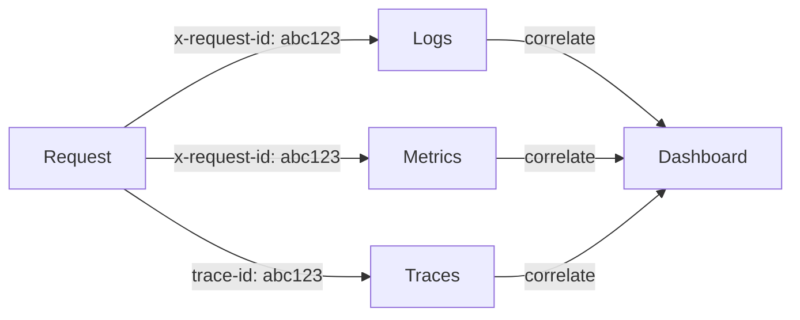

# Observability — Logs, Metrics, Traces

You can't fix what you can't see. Observability answers three questions: What happened (logs), how much (metrics), and where (traces). All three need correlation — a single request ID that connects a user click to the database query that was slow.

## When to Activate

Use when:
- Setting up logging, metrics, or tracing for a new service
- Defining SLOs/SLIs for a product or team
- Adding a correlation ID / request ID to the middleware pipeline
- Designing dashboards or alerting rules
- Investigating a production incident and need better signals
- Reviewing a PR for observability coverage (is this change measurable?)

**Trigger phrases:** "add logging", "structured logs", "metrics", "tracing", "SLO", "SLI", "error budget", "dashboard", "alerting", "correlation ID", "request ID", "Prometheus", "Grafana", "OpenTelemetry", "Datadog", "Sentry"

## When NOT to Use

| Situation | Use instead |
|---|---|
| Core Web Vitals, LCP, INP, bundle size | `skill-performance` |
| Error classification, error envelope, error boundaries | `skill-error-handling` |
| Designing the API endpoints that produce telemetry | `skill-api-rest` / `skill-api-graphql` |
| Infra-level monitoring (K8s, cloud) | `skill-devops` |

## Iron Laws

1. **Structured logs only.** No `console.log('user created')` — every log line is a JSON object with level, message, timestamp, and context fields.
2. **Every request has a correlation ID.** Generated at the edge, propagated through every service call, included in every log line and error response.
3. **Alert on symptoms, not causes.** Alert when the error rate SLO is breached, not when CPU hits 80%. CPU at 80% might be fine; error rate at 5% never is.
4. **If you can't measure it, you can't ship it.** Every feature ships with its metrics. A feature without telemetry is invisible in production.

## The Three Pillars + Correlation



## Correlation ID Middleware

```ts
// middleware/correlation.ts — generates or propagates request ID
import crypto from 'node:crypto';

export function correlationId(req: Request, res: Response, next: NextFunction) {
  const id = req.headers['x-request-id'] as string || crypto.randomUUID();
  req.id = id;
  res.setHeader('x-request-id', id);
  // Attach to logger context so every log line includes it
  req.log = logger.child({ requestId: id });
  next();
}
```

This ID appears in: every log line, every error response (`requestId` field — see `skill-error-handling`), every downstream service call (`x-request-id` header), and every trace span.

## Structured Logging

```ts
// Use pino (Node.js) or structlog (Python) — never console.log
import pino from 'pino';

const logger = pino({
  level: process.env.LOG_LEVEL || 'info',
  formatters: {
    level: (label) => ({ level: label }),
  },
  redact: ['req.headers.authorization', 'req.headers.cookie'],  // never log secrets
});

// Good — structured, searchable, contextual
logger.info({ userId: '123', orderId: 'abc', items: 5 }, 'Order created');

// Bad — unstructured, unsearchable
console.log('Created order abc for user 123 with 5 items');
```

```python
# Python — structlog
import structlog

logger = structlog.get_logger()

# Good
logger.info("order_created", user_id="123", order_id="abc", items=5)

# Bad
print(f"Created order abc for user 123 with 5 items")
```

| Level | Use for |
|---|---|
| `debug` | Developer-only detail (query params, cache decisions) |
| `info` | Business events (user created, order placed, payment received) |
| `warn` | Recoverable issues (retry succeeded, rate limit approached, deprecated API used) |
| `error` | Failures that need attention (unhandled exception, external service down) |
| `fatal` | Process is about to exit |

## Metrics — RED & USE

### RED metrics (for request-driven services)

| Metric | What | Instrument |
|---|---|---|
| **R**ate | Requests per second | Counter |
| **E**rrors | Failed requests per second | Counter (by status code) |
| **D**uration | Latency distribution | Histogram |

```ts
// Prometheus + prom-client (Node.js)
import { Counter, Histogram, register } from 'prom-client';

const httpRequests = new Counter({
  name: 'http_requests_total',
  help: 'Total HTTP requests',
  labelNames: ['method', 'route', 'status'],
});

const httpDuration = new Histogram({
  name: 'http_request_duration_seconds',
  help: 'HTTP request duration',
  labelNames: ['method', 'route'],
  buckets: [0.01, 0.05, 0.1, 0.25, 0.5, 1, 2.5, 5],
});

// Middleware — measure every request
app.use((req, res, next) => {
  const end = httpDuration.startTimer({ method: req.method, route: req.route?.path });
  res.on('finish', () => {
    httpRequests.inc({ method: req.method, route: req.route?.path, status: res.statusCode });
    end();
  });
  next();
});

// Expose /metrics endpoint for Prometheus scraping
app.get('/metrics', async (_, res) => {
  res.set('Content-Type', register.contentType);
  res.end(await register.metrics());
});
```

### USE metrics (for resources — CPU, memory, connections)

| Metric | What |
|---|---|
| **U**tilization | Percentage of resource capacity in use |
| **S**aturation | Queue depth, backlog |
| **E**rrors | Resource-level errors (OOM, connection refused) |

## Distributed Tracing

```ts
// OpenTelemetry — auto-instrumentation for Node.js
import { NodeSDK } from '@opentelemetry/sdk-node';
import { getNodeAutoInstrumentations } from '@opentelemetry/auto-instrumentations-node';
import { OTLPTraceExporter } from '@opentelemetry/exporter-trace-otlp-http';

const sdk = new NodeSDK({
  traceExporter: new OTLPTraceExporter({ url: 'http://otel-collector:4318/v1/traces' }),
  instrumentations: [getNodeAutoInstrumentations()],
  serviceName: 'order-service',
});

sdk.start();
```

Auto-instrumentation captures: HTTP requests (inbound + outbound), database queries (pg, mysql, mongo), Redis, gRPC. Manual spans for business logic:

```ts
import { trace } from '@opentelemetry/api';

const tracer = trace.getTracer('order-service');

async function processOrder(orderId: string) {
  return tracer.startActiveSpan('processOrder', async (span) => {
    span.setAttribute('order.id', orderId);
    try {
      const result = await doWork(orderId);
      span.setStatus({ code: SpanStatusCode.OK });
      return result;
    } catch (err) {
      span.setStatus({ code: SpanStatusCode.ERROR, message: err.message });
      throw err;
    } finally {
      span.end();
    }
  });
}
```

## SLOs / SLIs

| Term | Definition | Example |
|---|---|---|
| **SLI** (Service Level Indicator) | The metric you measure | P99 latency of `/api/orders` |
| **SLO** (Service Level Objective) | The target for that metric | P99 latency < 500ms, 99.9% of the time |
| **Error Budget** | How much failure is tolerable | 0.1% of requests can breach the SLO per month |

Define SLOs before building dashboards. A dashboard without an SLO is a pretty picture; an SLO without a dashboard is a broken promise.

## Alerting Discipline

| Rule | Why |
|---|---|
| Alert on SLO breach, not on causes | CPU at 80% might be fine; error rate at 2% never is |
| Every alert has a runbook link | On-call at 3am shouldn't have to guess what to do |
| Suppress duplicate alerts (dedup window) | 500 alerts for one incident is noise, not signal |
| Page for user-facing impact; ticket for degradation | Not everything is a 3am wakeup |
| Review alert fatigue monthly | If >50% of pages are no-ops, thresholds are wrong |

## Observability Stack Selection

| Layer | Options |
|---|---|
| **Logs** | ELK (Elasticsearch + Kibana), Loki + Grafana, Datadog Logs |
| **Metrics** | Prometheus + Grafana, Datadog Metrics, CloudWatch |
| **Traces** | Jaeger, Tempo + Grafana, Datadog APM, Honeycomb |
| **All-in-one** | Datadog, New Relic, Dynatrace, Grafana Cloud |
| **Error tracking** | Sentry, Bugsnag |

Default: **Grafana Cloud (Loki + Prometheus + Tempo)** for open-source stack. **Datadog** if budget allows and you want one pane of glass.

## Common Failure Modes

| Pattern | Why it fails / consequence |
|---|---|
| `console.log` in production | Unstructured, unsearchable, no context — useless under pressure |
| No request ID / correlation ID | Can't trace a user's journey across log lines |
| Alerting on CPU instead of error rate | Get paged for autoscaling events; miss actual user-facing failures |
| No log redaction | Secrets (auth headers, tokens) end up in log aggregator |
| Metrics without labels | `http_requests_total` without `route` or `status` can't answer any question |
| Too many cardinality labels | `user_id` as a metric label = millions of series = OOM on Prometheus |
| SLO defined but never measured | Dashboard shows green because nobody wired the SLI |
| Alert fatigue — every alert is critical | On-call ignores pages; real incident missed |
| Traces without business context | Span says "db.query 50ms" but not which order or which user |

## Observability Review Checklist

- [ ] Every log line is structured JSON (pino, structlog, or equivalent)
- [ ] Correlation ID generated at edge, propagated to all downstream calls
- [ ] Correlation ID included in error responses (`requestId`)
- [ ] RED metrics instrumented on all HTTP endpoints
- [ ] Metrics endpoint exposed (`/metrics`) for Prometheus or equivalent
- [ ] Distributed tracing configured with auto-instrumentation
- [ ] SLOs defined for user-facing services with error budgets
- [ ] Alerts tied to SLO breaches, not raw resource metrics
- [ ] Every alert has a runbook link
- [ ] Secrets redacted from logs (auth headers, cookies, tokens)
- [ ] No high-cardinality labels on metrics (user IDs, request IDs)

## Integration

- `domains/webdev/skill-error-handling` — errors flow through the global handler; correlation ID appears in error responses
- `domains/webdev/skill-backend` — middleware pipeline includes correlation ID generation
- `domains/webdev/skill-api-rest` — request metrics are per-endpoint
- `domains/webdev/skill-api-graphql` — resolver-level tracing, per-operation metrics
- `domains/webdev/skill-performance` — RUM / field data complements server-side observability
- `domains/webdev/skill-deployment` — canary promotion decisions depend on metrics
- `domains/webdev/skill-devops` — infrastructure hosting the observability stack

## Resources

- [OpenTelemetry docs](https://opentelemetry.io/docs/) — vendor-neutral tracing + metrics
- [pino](https://getpino.io/) — fast structured logging for Node.js
- [structlog](https://www.structlog.org/) — structured logging for Python
- [RED Method (Tom Wilkie)](https://grafana.com/blog/2018/08/02/the-red-method-how-to-instrument-your-services/) — request-driven metrics
- [USE Method (Brendan Gregg)](https://www.brendangregg.com/usemethod.html) — resource metrics
- [Google SRE Book — SLOs](https://sre.google/sre-book/service-level-objectives/) — SLI/SLO/error budget
