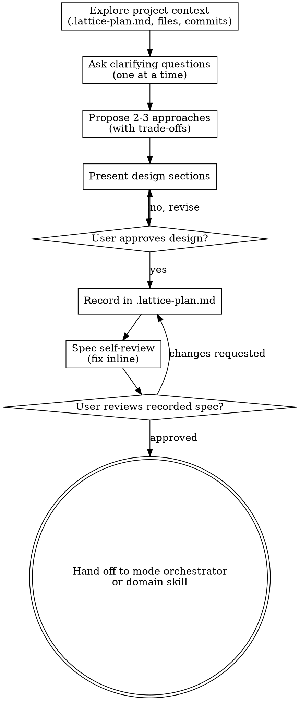

<!-- ADAPTED from D:/skills/community/writing/brainstorming/SKILL.md
     Adaptations: Lattice frontmatter (no version/license), When to Activate block,
     reframed downstream skills from superpowers (writing-plans / frontend-design /
     mcp-builder) to Lattice mode handoffs, replaced docs/superpowers/specs/ design
     location with .lattice-plan.md scoped path, added Integration with Other Skills,
     pruned visual-companion section to a brief pointer (no separate file in Lattice). -->
---
name: brainstorming-protocol
description: Lattice brainstorming protocol — MUST be used before any creative implementation work in any Lattice mode. Use whenever the user wants to add a new feature, component, model architecture, thesis chapter, experiment, dataset pipeline, or modify behavior. Explores intent, requirements, constraints, and trade-offs through one-question-at-a-time dialogue, then produces an approved design before implementation. Hard-gates downstream domain skills until design is reviewed and approved.
---

# Brainstorming Protocol

Turn ideas into validated designs through collaborative dialogue before any implementation begins.

Start by understanding the current project context, then ask questions one at a time to refine the idea. Once you understand what is being built, present the design and get explicit user approval.

## When to Activate

**Always activate before:**
- Adding a new feature, component, or capability (project-lattice)
- Designing a new model architecture or training run (model-lattice)
- Drafting a new chapter, methodology, or experiment plan (thesis-lattice)
- Modifying behavior of an existing system in a non-trivial way
- Any creative or design work where assumptions could go wrong

**Trigger phrases:**
- "let's build", "let's add", "I want to make"
- "new feature", "new component", "new chapter", "new experiment"
- "design", "design doc", "spec", "plan", "what should we build"
- "I have an idea", "thinking about", "could we"
- Any phrasing that proposes work without an existing approved design

## Hard Gate

<!-- ADAPTED: rewritten from <HARD-GATE> XML to a Lattice-style heading;
     reframed the implementation-skills list from superpowers names
     (writing-plans, frontend-design, mcp-builder) to Lattice mode handoffs. -->

**Do NOT invoke any Lattice mode orchestrator (project-lattice, model-lattice, thesis-lattice), do NOT invoke any domain skill that produces deliverables, and do NOT write any code, schema, or content until you have presented a design and the user has approved it.**

This applies to EVERY project regardless of perceived simplicity.

## Anti-Pattern: "This Is Too Simple To Need A Design"

Every project goes through this protocol. A todo list, a single API endpoint, a config change, a one-page abstract — all of them. "Simple" projects are where unexamined assumptions cause the most wasted work. The design can be short (a few sentences for genuinely simple projects), but you MUST present it and get approval.

## Checklist

You MUST track each of these items and complete them in order:

1. **Explore project context** — read `.lattice-plan.md` if it exists, scan recent files, recent commits, and the active mode
2. **Ask clarifying questions** — one at a time, understand purpose, constraints, success criteria
3. **Propose 2-3 approaches** — with trade-offs and your recommendation (apply Unsure Protocol)
4. **Present design** — in sections scaled to complexity; get user approval after each section
5. **Record design in `.lattice-plan.md`** — under the relevant phase or domain
6. **Spec self-review** — quick inline check for placeholders, contradictions, ambiguity, scope
7. **User reviews recorded design** — wait for explicit approval before proceeding
8. **Hand off** — to the appropriate Lattice mode orchestrator or domain skill

## Process Flow

## The Process

### Understanding the idea

- Read `.lattice-plan.md` first to understand active mode, prior decisions, and where this idea fits
- Before asking detailed questions, assess scope: if the request describes multiple independent subsystems (e.g., "a thesis with experiments, literature review, and a custom dataset"), flag this immediately. Don't spend questions refining details of a project that needs to be decomposed first.
- If the idea is too large for a single design pass, help the user decompose into sub-projects: what are the independent pieces, how do they relate, what order should they be built? Then brainstorm the first sub-project through the normal flow. Each sub-project gets its own design → plan → implementation cycle in `.lattice-plan.md`.
- For appropriately-scoped ideas, ask questions one at a time
- Prefer multiple-choice questions when possible, open-ended is fine when the question genuinely needs it
- One question per message — if a topic needs more exploration, break it into multiple questions
- Focus on understanding: purpose, constraints, success criteria

### Exploring approaches

- Propose 2-3 different approaches with trade-offs
- Present options conversationally with your recommendation and reasoning
- Lead with your recommended option and explain why
- This is the Unsure Protocol applied at design time — present top options, recommend, explain

### Presenting the design

- Once you understand what is being built, present the design
- Scale each section to its complexity: a few sentences if straightforward, up to 200-300 words if nuanced
- Ask after each section whether it looks right so far
- Cover: architecture/structure, components/sections, data/information flow, error/failure handling, validation/testing
- Be ready to go back and clarify if something doesn't make sense

### Design for isolation and clarity

- Break the system into smaller units that each have one clear purpose, communicate through well-defined interfaces, and can be understood and tested (or reviewed) independently
- For each unit, you should be able to answer: what does it do, how is it used, and what does it depend on?
- Can someone understand what a unit does without reading its internals? Can you change the internals without breaking consumers? If not, the boundaries need work.
- Smaller, well-bounded units are easier to reason about, easier to edit reliably, and easier for the user to review. Large monolithic files are usually a signal something is doing too much.

### Working in existing codebases or documents

- Explore the current structure before proposing changes. Follow existing patterns.
- Where existing material has problems that affect the new work (a file/chapter that's grown too large, unclear boundaries, tangled responsibilities), include targeted improvements as part of the design.
- Don't propose unrelated refactoring. Stay focused on what serves the current goal.

## After the Design

### Recording

<!-- ADAPTED: original wrote design docs to docs/superpowers/specs/YYYY-MM-DD-<topic>-design.md.
     In Lattice, designs live in .lattice-plan.md to keep one source of project memory. -->

- Record the validated design under the relevant phase or domain section in `.lattice-plan.md`
- Use the design template from `shared/lattice-plan-template.md` as a guide for structure
- Commit `.lattice-plan.md` after recording

### Spec self-review

After recording, look at the design with fresh eyes:

1. **Placeholder scan:** Any "TBD", "TODO", incomplete sections, or vague requirements? Fix them.
2. **Internal consistency:** Do any sections contradict each other? Does the proposed architecture match the described behavior?
3. **Scope check:** Is this focused enough for a single implementation cycle, or does it need decomposition?
4. **Ambiguity check:** Could any requirement be interpreted two different ways? If so, pick one and make it explicit.

Fix any issues inline. No need to re-review — just fix and move on.

### User review gate

After the spec self-review, ask the user to review the recorded design:

> "Design recorded in `.lattice-plan.md` under [section]. Please review and let me know if you want changes before we proceed to implementation."

Wait for the user's response. If they request changes, make them and re-run the self-review. Only proceed once the user explicitly approves.

### Handoff

<!-- ADAPTED: original handed off to writing-plans skill (superpowers).
     Lattice has no writing-plans equivalent — instead hand off to the Lattice mode
     orchestrator or directly to the relevant domain skill once design is approved. -->

After approval:
- Hand off to the appropriate Lattice mode orchestrator (`modes/project-lattice.md`, `modes/model-lattice.md`, or `modes/thesis-lattice.md`) if this is the start of a new phase
- Or invoke the relevant domain skill from `domains/` if continuing within an active phase
- Do NOT invoke any other planning protocol — design is now done; the next step is implementation

## Key Principles

- **One question at a time** — Don't overwhelm with multiple questions
- **Multiple choice preferred** — Easier to answer than open-ended when possible
- **YAGNI ruthlessly** — Remove unnecessary features from all designs
- **Explore alternatives** — Always propose 2-3 approaches before settling
- **Incremental validation** — Present design, get approval before moving on
- **Be flexible** — Go back and clarify when something doesn't make sense
- **Single source of memory** — Designs live in `.lattice-plan.md`, not in scattered files

## Visual Aids (Optional)

<!-- ADAPTED: original had a 50-line visual-companion section referencing a separate
     visual-companion.md file. Lattice skills are single-file; pruned to a brief note. -->

When a question genuinely benefits from visual treatment (mockups, wireframes, layout comparisons, architecture diagrams, side-by-side designs), produce a quick ASCII mockup or graphviz diagram inline. Use the test: **would the user understand this better by seeing it than reading it?**

- **Visual:** mockups, wireframes, layouts, architecture diagrams
- **Text:** requirements questions, conceptual choices, trade-off lists, A/B/C/D text options

A question about a UI topic is not automatically a visual question. "What does 'minimal' mean here?" is conceptual — use text. "Which of these two layouts works better?" is visual — produce a sketch.

## Integration with Other Skills

- **shared/unsure-protocol.md** — apply during the "propose 2-3 approaches" step; present top options with pros/cons and a recommendation
- **shared/resume-protocol.md** — if `.lattice-plan.md` already has an in-progress phase, resume there before starting brainstorming
- **shared/lattice-plan-template.md** — template structure for recording the design under the right section
- **modes/*-Lattice.md** — handoff destination once design is approved
- **domains/*/skill-*.md** — invoked after handoff to produce the actual deliverables
