<!-- ADAPTED from D:/GSD/README.md (How It Works), D:/GSD/docs/ARCHITECTURE.md
     (Phase Execution Flow), and the discuss/plan/execute/verify command structure
     in D:/GSD/commands/gsd/. Adaptations: collapsed GSD's six steps into the
     four-step DPEV loop (init/ship folded into mode orchestrators and
     finishing-branch skill), reframed for Lattice's three modes, replaced
     gsd-* agent invocations with Lattice skill invocations, kept decision
     coverage as a first-class section. -->

# The Discuss → Plan → Execute → Verify (DPEV) Loop

How a Lattice phase actually progresses from idea to verified deliverable. This is the operational backbone of all three modes once brainstorming has produced a phase to work on.

## When to Apply

Apply the DPEV loop for any phase that warrants its own folder under `.lattice/phases/` (see `phase-artifacts-protocol.md`). For trivial one-off changes, skip the loop and just do the work — record outcome in `.lattice-plan.md`.

## The Four Steps

```dot
digraph dpev {
    rankdir=LR;
    discuss [label="DISCUSS\nDecisions\n→ CONTEXT.md", shape=box, style=filled, fillcolor="#e3f2fd"];
    plan [label="PLAN\nResearch + Tasks\n→ RESEARCH.md, PLAN.md", shape=box, style=filled, fillcolor="#fff9c4"];
    execute [label="EXECUTE\nImplement\n→ SUMMARY.md", shape=box, style=filled, fillcolor="#c8e6c9"];
    verify [label="VERIFY\nReview\n→ VERIFICATION.md", shape=box, style=filled, fillcolor="#f8bbd0"];
    ship [label="Phase done\n(ship / commit / submit)", shape=ellipse];

    discuss -> plan;
    plan -> execute;
    execute -> verify;
    verify -> ship [label="passes"];
    verify -> execute [label="fixes needed"];
    plan -> discuss [label="revealed open questions"];
}
```



### 1. DISCUSS — Capture decisions before planning

**Goal:** Convert the phase's one-line description (from `.lattice-plan.md`) into specific, locked decisions that the plan can rely on.

**Process:**
1. Re-read the phase row in `.lattice-plan.md` and the previous phase's SUMMARY.md (if any)
2. Apply the questioning protocol (`questioning-protocol.md`) — find the gray areas in this phase
3. For each gray area, present 2-3 options (apply Unsure Protocol) and capture the user's choice
4. Write CONTEXT.md with: Goal, Why now, Decisions locked, Out of scope, Dependencies

**Exit criteria:**
- CONTEXT.md exists and contains at least one Decision locked
- User has confirmed CONTEXT.md is complete

**Skip when:** the phase is so well-defined in `.lattice-plan.md` that there are no gray areas. Write a one-line CONTEXT.md noting "No discussion needed; following `.lattice-plan.md` row N verbatim."

### 2. PLAN — Research + Tasks

**Goal:** Convert CONTEXT.md decisions into a concrete, executable PLAN.md.

**Process:**
1. Read CONTEXT.md and the previous phase's SUMMARY.md
2. Identify research needs (unfamiliar APIs, unknown library behavior, ambiguous requirements). Write RESEARCH.md with findings.
3. If research surfaces unresolved open questions that affect decisions → loop back to DISCUSS
4. Decompose into ordered tasks. Each task names: what to do, files affected, verification step, acceptance criteria
5. Add the **Decision coverage** section — checklist confirming every CONTEXT.md decision maps to at least one task
6. Run plan-checker-protocol.md before declaring PLAN.md ready

**Exit criteria:**
- PLAN.md exists with all required sections (objective, tasks, decision coverage, verification, success criteria)
- Plan-checker has passed (or escalated after max iterations)
- No unresolved open questions in RESEARCH.md that block planning

**Skip when:** research is unnecessary AND tasks are obvious. Write a 5-line PLAN.md with just the task list.

### 3. EXECUTE — Implement

**Goal:** Produce the phase's deliverables according to PLAN.md.

**Process:**
1. Read CONTEXT.md, PLAN.md, RESEARCH.md (if exists)
2. Work through tasks in order (or in parallel groups if PLAN.md marks them independent)
3. Apply TDD discipline (`domains/shared/skill-tdd.md`) for code with testable behavior
4. Commit per task using the convention `{type}({phase}-{task}): description` — e.g., `feat(02-auth-03): implement JWT validation`
5. After each task, update SUMMARY.md with what was built, deviations, open issues
6. If a deviation changes a locked decision, STOP and route back to DISCUSS — do not silently change the decision

**Exit criteria:**
- All PLAN.md tasks have either succeeded or have a documented deferral/blocker
- SUMMARY.md is complete

**Subagent dispatch:** For long-running phases, consider spawning fresh-context subagents per parallel task group. The main orchestrator stays light; each subagent gets the relevant CONTEXT.md, PLAN.md, and only its own task slice.

### 4. VERIFY — Review

**Goal:** Independently confirm the phase met its success criteria before declaring it shippable.

**Process:**
1. Read PLAN.md success criteria + SUMMARY.md outcomes
2. For each success criterion, gather evidence (run tests, check files, inspect behavior). Mark PASSED / FAILED / PARTIAL.
3. Run the **Decision coverage check**: every locked decision in CONTEXT.md must show up in shipped work. Missing decisions are FAILED criteria, not nice-to-haves.
4. Write VERIFICATION.md with per-criterion results, gaps, and a final recommendation
5. **If PASSED:** present to user for UAT. Phase is shippable.
6. **If FAILED or PARTIAL:** route gaps back to EXECUTE as a fix list. Do not advance.

**Exit criteria:**
- VERIFICATION.md exists with a clear recommendation
- All success criteria PASSED OR user has explicitly accepted PARTIAL with documented deferrals

**Skip when:** the phase's success criteria are trivially observable (the build runs, the file exists). Write a 2-line VERIFICATION.md noting the criteria check.

## Decision Coverage — first-class

**The single most-important rule of the loop:** decisions captured in CONTEXT.md must show up in PLAN.md (as tasks or constraints) AND in shipped work (verified in VERIFICATION.md). Decisions that get lost between steps are the #1 source of "I asked for X but you built Y" frustration.

**Where it's enforced:**
- PLAN.md has a `## Decision coverage` checklist mapping each CONTEXT decision → task(s)
- plan-checker-protocol.md fails if any decision is unmapped
- VERIFICATION.md re-checks coverage against shipped artifacts

**Example:**

```markdown
# CONTEXT.md (excerpt)
## Decisions locked
- D1: Use PostgreSQL with row-level security
- D2: All API routes require JWT auth except /health
- D3: Rate limit: 100 req/min per user

# PLAN.md (excerpt)
## Decision coverage
- [x] D1 → Task 03 (set up Postgres + RLS policies)
- [x] D2 → Task 05 (add JWT middleware), Task 06 (whitelist /health)
- [x] D3 → Task 07 (add rate limiter)

# VERIFICATION.md (excerpt)
## Decision coverage check
- D1 → ✓ Verified: RLS policies exist on all tables, tested in tests/rls.test.ts
- D2 → ✓ Verified: middleware in src/middleware/auth.ts, /health bypassed
- D3 → ⚠ PARTIAL: rate limiter exists but limit is 200/min, not 100/min — needs fix
```

## Per-Mode Adaptation

### project-lattice

The DPEV loop runs per phase (a feature, a milestone, a deployable increment). Verification typically includes running the test suite and checking the deliverable end-to-end.

### model-lattice

DPEV runs per experiment or system stage. CONTEXT.md captures the hypothesis. PLAN.md is the experiment design. SUMMARY.md is the result. VERIFICATION.md confirms the experiment was run as designed and results are reproducible.

### thesis-lattice

DPEV runs per chapter or major section. CONTEXT.md captures the chapter's scope and argument. PLAN.md is the section structure. EXECUTE produces the draft. VERIFICATION.md is the consistency check, citation check, and argument-validation pass.

## When to Loop, When to Escalate

| Situation | Action |
|---|---|
| PLAN reveals unresolved open question | Loop back to DISCUSS |
| EXECUTE reveals a locked decision is wrong | STOP, escalate to user, route back to DISCUSS |
| EXECUTE finishes with partial deliverable | Document in SUMMARY, proceed to VERIFY which will catch gaps |
| VERIFY finds gaps | Route back to EXECUTE with fix list |
| VERIFY iterates 3 times without convergence | Escalate to user |
| Plan-checker fails 3 times | Escalate to user (likely the underlying decisions need rethinking) |

## What NOT to Do

- **Do not** skip DISCUSS for "obvious" phases. The phases that feel obvious are the ones where assumptions diverge most.
- **Do not** start EXECUTE before plan-checker passes. Bad plans waste execute time.
- **Do not** modify a locked decision during EXECUTE without routing through DISCUSS.
- **Do not** declare a phase done without VERIFICATION.md (or a one-line equivalent for trivial phases).
- **Do not** advance to the next phase before SUMMARY.md is written. The next phase's DISCUSS reads it.

## The Principle

DPEV makes implicit work explicit. Every step has an artifact. Every decision has a mapping. Every claim of "done" has a verification. The loop is the safety harness that lets long phases ship without surprises.
