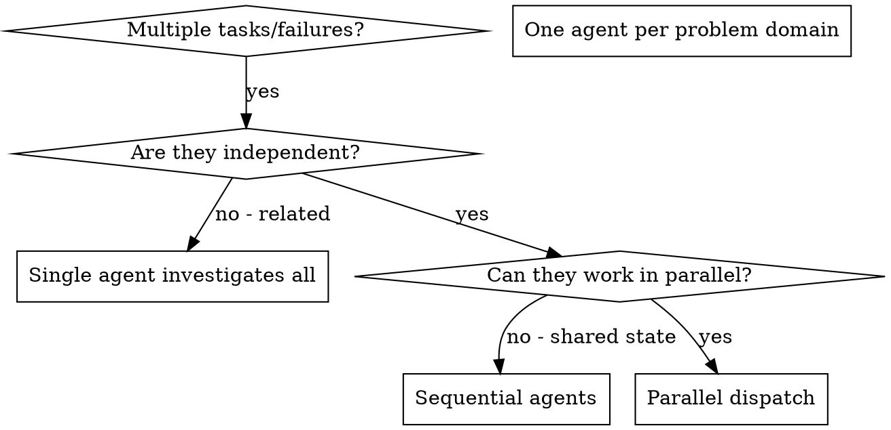

<!-- ADAPTED from C:/Users/janvi/.claude/plugins/marketplaces/superpowers-dev/skills/dispatching-parallel-agents/SKILL.md
     Adaptations: dropped frontmatter (shared protocol), reframed superpowers-specific
     references, added Lattice-specific use cases (per-mode), added explicit guidance on
     how to construct subagent prompts within Lattice's three modes. The when-to-use
     decision tree, common mistakes, and verification checklist are preserved verbatim. -->

# The Parallel Agents Protocol

When facing 2+ independent tasks that share no state and have no sequential dependency, dispatch them as parallel subagents. Each gets isolated context. The orchestrator coordinates, the agents work concurrently.

## Core Principle

You delegate tasks to specialized agents with isolated context. By precisely crafting their instructions and context, you ensure they stay focused and succeed at their task. They never inherit your session's context or history — you construct exactly what they need. This also preserves your own context for coordination work.

When you have multiple unrelated failures (different test files, different subsystems, different bugs), investigating them sequentially wastes time. Each investigation is independent and can happen in parallel.

**One agent per independent problem domain. Let them work concurrently.**

## When to Use



**Use when:**
- 3+ test files failing with different root causes
- Multiple subsystems broken independently
- Each problem can be understood without context from the others
- No shared state between investigations
- Multiple research questions for one phase that don't depend on each other (parallel `RESEARCH.md` contributors)
- Multiple unrelated improvements during EXECUTE that touch different files

**Don't use when:**
- Failures are related (fix one might fix others)
- You need to understand the full system state
- Agents would interfere with each other (editing the same files)
- The task is exploratory — you don't know what's broken yet

## The Pattern

### 1. Identify independent domains

Group tasks/failures by what's broken or what's being investigated:

- File A tests: tool approval flow
- File B tests: batch completion behavior
- File C tests: abort functionality

Each domain is independent — fixing tool approval doesn't affect abort tests.

### 2. Create focused agent tasks

Each agent gets:

- **Specific scope:** one test file, one subsystem, one research question
- **Clear goal:** "make these tests pass" / "answer these specific questions"
- **Constraints:** "don't change other code", "don't read other files"
- **Expected output:** "summary of what you found and fixed", "answer in this format"

### 3. Dispatch in parallel

Use the Task tool with multiple agent invocations in the SAME tool block — that is what makes them parallel. If you call them sequentially across multiple tool blocks, they run sequentially.

### 4. Review and integrate

When agents return:

- Read each summary
- Verify fixes don't conflict
- Run the full test suite
- Integrate all changes
- Apply `verification-protocol.md` before declaring the work done

## Agent Prompt Structure

Good agent prompts are:

1. **Focused** — one clear problem domain
2. **Self-contained** — all context needed to understand the problem (paste error messages, paths, relevant snippets — agents do NOT inherit your session)
3. **Specific about output** — what should the agent return?

**Example for debugging:**

```markdown
Fix the 3 failing tests in src/agents/agent-tool-abort.test.ts:

1. "should abort tool with partial output capture" — expects 'interrupted at' in message
2. "should handle mixed completed and aborted tools" — fast tool aborted instead of completed
3. "should properly track pendingToolCount" — expects 3 results but gets 0

These look like timing/race condition issues. Your task:

1. Read the test file and understand what each test verifies
2. Identify root cause — timing issues or actual bugs?
3. Fix by:
   - Replacing arbitrary timeouts with event-based waiting
   - Fixing bugs in the abort implementation if found
   - Adjusting test expectations only if the test was wrong

Do NOT just increase timeouts — find the real issue.
Apply skill-debugging.md (4-phase systematic method).
Apply verification-protocol.md before claiming the fix works.

Return: summary of root cause and changes made.
```

## Common Mistakes

| Mistake | Fix |
|---|---|
| ❌ Too broad: "Fix all the tests" | ✅ Specific: "Fix agent-tool-abort.test.ts" |
| ❌ No context: "Fix the race condition" | ✅ Paste the error messages, test names, file paths |
| ❌ No constraints: agent might refactor everything | ✅ "Do NOT change production code" or "Fix tests only" |
| ❌ Vague output: "Fix it" | ✅ "Return summary of root cause and changes" |
| ❌ Sequential dispatch (across multiple tool blocks) | ✅ All invocations in one tool block run in parallel |
| ❌ Two agents editing the same file | ✅ Verify file ownership before dispatch |

## When NOT to Use

- **Related failures:** fixing one might fix others — investigate together first
- **Need full context:** understanding requires seeing the entire system
- **Exploratory debugging:** you don't know what's broken yet
- **Shared state:** agents would interfere (editing same files, using same resources)

## Per-Mode Adaptation

### project-lattice — parallel debugging or investigation

Use most often. Three failing test files in unrelated subsystems → three parallel debugger agents. Three independent feature audits → three parallel reviewers. Three code-review subagents on three different commits → done in the time of one.

### model-lattice — parallel ablations or research

Use for parallel research arms during the PLAN step. "Which optimizer works best?" → three agents, each researching one optimizer (Adam, AdamW, Lion). They each return a recommendation; you synthesize.

For training runs themselves, parallel dispatch is risky — most local setups can't run multiple training jobs without resource contention. Use sequential or queue them.

### thesis-lattice — parallel literature review

Use when surveying literature across multiple sub-areas. "Find recent work on X, Y, Z" → three agents, each reading and summarizing one sub-area. They return structured summaries; you weave them into the related-work section.

## Real Example

**Scenario:** 6 test failures across 3 files after a major refactor.

**Failures:**
- `agent-tool-abort.test.ts`: 3 failures (timing issues)
- `batch-completion-behavior.test.ts`: 2 failures (tools not executing)
- `tool-approval-race-conditions.test.ts`: 1 failure (execution count = 0)

**Decision:** Independent domains — abort logic, batch completion, race conditions.

**Dispatch:**
```
Agent 1 → Fix agent-tool-abort.test.ts
Agent 2 → Fix batch-completion-behavior.test.ts
Agent 3 → Fix tool-approval-race-conditions.test.ts
```

**Results:**
- Agent 1: replaced timeouts with event-based waiting
- Agent 2: fixed event-structure bug (threadId in wrong place)
- Agent 3: added wait for async tool execution to complete

**Integration:** all fixes independent, no conflicts, full suite green.

**Time saved:** 3 problems solved in parallel vs. sequentially.

## Key Benefits

1. **Parallelization** — multiple investigations happen simultaneously
2. **Focus** — each agent has narrow scope, less context to track
3. **Independence** — agents don't interfere with each other
4. **Speed** — 3 problems solved in the time of 1
5. **Context preservation** — your main context stays clean for coordination

## Verification

After agents return:

1. **Review each summary** — understand what changed
2. **Check for conflicts** — did agents edit the same code?
3. **Run the full suite** — verify all fixes work together
4. **Spot check** — agents can make systematic errors
5. **Apply verification-protocol** — quote the test output before declaring done

## Inter-Agent Communication: LICP v1 (Windows Compatible)

To coordinate parallel subagents on Windows without relying on Unix-socket IPC channels, Lattice utilizes a file-based bus topology.

### File-Based Message Bus
- All communication passes through the path `.lattice/ipc/topics/*.jsonl`.
- Each topic has a dedicated `.jsonl` file (e.g., `orchestration.jsonl`, `file_locks.jsonl`).
- Messages are written as append-only JSON lines to avoid file access race conditions on Windows.

### LICP v1 Envelope
Every message in the IPC bus must follow the Lattice Inter-agent Communication Protocol (LICP) v1 schema:

```json
{
  "v": "1.0",
  "id": "01H2V...",        // ULID for ordering and uniqueness
  "from": "subagent_01",
  "to": "orchestrator",
  "topic": "file_locks",
  "timestamp": "2026-05-25T07:44:10Z",
  "vector_clock": { "orchestrator": 2, "subagent_01": 1 },
  "priority": 2,          // 1 (high), 2 (normal), 3 (low)
  "ttl_ms": 30000,
  "payload": { ... },     // Topic-specific payload
  "causal_parent": "01H2V..." // Reference to triggering message ULID
}
```

### Topology
Lattice implements a **Hub-and-Spoke** topology:
- Subagents send messages only to the parent orchestrator (the hub).
- The orchestrator validates, logs, and routes messages to the appropriate target subagents (the spokes).

### Conflict Prevention (Claim Regions)
To prevent parallel agents from corrupting shared source files, agents must negotiate lock reservations on the bus prior to editing:
- A claim region consists of:
  ```json
  {
    "path": "src/controllers/userController.ts",
    "lines": [10, 50],
    "mode": "exclusive" // "exclusive" | "append" | "shared-read"
  }
  ```
- No agent may perform a file write to a region that has an active `exclusive` claim by another agent.

## Integration with Other Skills

- **shared/verification-protocol.md** — applied before claiming the integrated result is good
- **domains/shared/skill-debugging.md** — each parallel agent applies the 4-phase debug method to its slice
- **shared/dpev-loop-protocol.md** — parallel research during PLAN, parallel execution during EXECUTE (when tasks are marked independent in PLAN.md), parallel verification during VERIFY
- **shared/references/anti-patterns-reference.md** — anti-patterns 1, 4, 10 (delegate heavy work, give agents only what they need) apply directly
