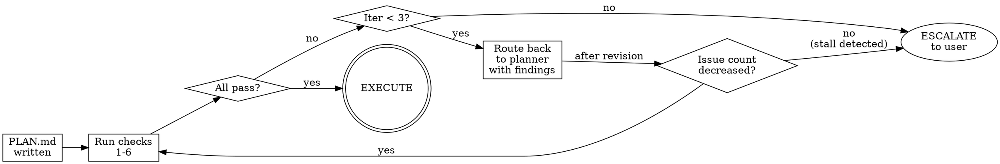

<!-- ADAPTED from D:/GSD/agents/gsd-plan-checker.md and the revision-loop section
     of D:/GSD/get-shit-done/references/revision-loop.md. Adaptations: collapsed
     the multi-agent invocation pattern into a single-pass checklist that the
     Lattice orchestrator runs inline, kept the iteration cap and stall-detection
     escalation logic, replaced GSD-specific paths with Lattice equivalents. -->

# The Plan-Checker Protocol

Verify a phase's PLAN.md is good before letting EXECUTE start. Catches bad plans cheaply — bad plans burn execute time.

## When to Apply

Run plan-checker after writing PLAN.md and before starting EXECUTE. Required for any phase that has a CONTEXT.md (i.e., went through DISCUSS). Optional for trivial phases that skipped DISCUSS.

## The Checks

Run these checks in order. Each one is fast and deterministic. Stop at the first failure.

### Check 1 — Required artifacts exist

- [ ] CONTEXT.md exists (or DISCUSS was explicitly skipped with a note)
- [ ] PLAN.md exists at `.lattice/phases/NN-name/PLAN.md`
- [ ] If RESEARCH.md exists, it has no unresolved open questions

**Failure → Pre-flight gate.** Cannot start checking; route to fix the missing artifact.

### Check 2 — PLAN.md structure

PLAN.md must have all required sections:
- [ ] `## Objective` — restates the phase goal
- [ ] `## Tasks` — ordered list of tasks
- [ ] `## Decision coverage` — checklist mapping each CONTEXT decision to task(s)
- [ ] `## Verification` — how to confirm the phase is done
- [ ] `## Success criteria` — measurable outcomes

**Failure → Revision gate.** Route back to planner with specific list of missing sections.

### Check 3 — Decision coverage

For every decision locked in CONTEXT.md, verify it appears as a checklist item under PLAN.md `## Decision coverage`, mapped to one or more tasks.

```
For each line in CONTEXT.md `## Decisions locked`:
  Find matching `[x] D{N}` line in PLAN.md `## Decision coverage`
  If missing → FAILED
  If present but `[ ]` (not checked) → PARTIAL (treat as failed for revision)
  If checked but doesn't reference any task by ID → FAILED (mapping is empty)
```

**Failure → Revision gate.** Route back to planner with the list of missing or unmapped decisions.

### Check 4 — Task specificity

Each task in PLAN.md must specify:
- [ ] What to do (action verb + concrete object)
- [ ] Files affected (paths or patterns)
- [ ] Verification step (command, test, observation)
- [ ] Acceptance criteria (a measurable "this is done when")

**Vague tasks fail.** Examples:

| Task | Verdict |
|---|---|
| "Implement authentication" | FAIL — no files, no verification, no acceptance |
| "Add JWT middleware in `src/middleware/auth.ts`; verify with `npm test src/middleware/auth.test.ts`; done when `/protected` returns 401 without token and 200 with valid token" | PASS |

**Failure → Revision gate.** Route back to planner with the list of vague tasks and what's missing per task.

### Check 5 — Dependency soundness

- [ ] No task references a file or interface that no earlier task creates
- [ ] No task is marked parallel-with another that modifies the same file
- [ ] No circular dependencies between tasks

**Failure → Revision gate.** Route back to planner with the dependency conflict.

### Check 6 — Scope sanity

- [ ] PLAN.md does not include work explicitly listed in CONTEXT.md `## Out of scope`
- [ ] Total task count is reasonable for one phase (heuristic: > 15 tasks suggests the phase should be split)
- [ ] No task feels like it should be its own phase (heuristic: a task whose acceptance criteria require a separate verification pass)

**Failure → Escalation gate.** This is a judgment call; surface to user with a recommendation to either trim scope, split the phase, or accept the risk.

## The Revision Loop



**Iteration cap: 3.** After 3 revision attempts, escalate to user regardless of remaining issues.

**Stall detection.** Between iterations, count remaining issues. If the count does not decrease, escalate immediately — the planner is stuck and more attempts will not help.

## Escalation Format

When escalating to user, present:

```markdown
Plan-checker has surfaced issues that I cannot resolve automatically:

**Phase:** NN-name
**Iterations attempted:** N of 3
**Remaining issues:**
- [check] [specific issue]
- [check] [specific issue]

**My read:** [one sentence on what's likely going on — e.g., "the underlying CONTEXT decisions feel underspecified for the scope, and the planner is generating tasks that all have the same vague problem"]

**Options:**
1. Loop back to DISCUSS — refine CONTEXT.md to resolve ambiguity
2. Split the phase — current scope is too big to plan well
3. Accept current PLAN.md as-is and proceed to EXECUTE despite the issues
4. Let me try one more time with [specific change]

Which would you like?
```

## What NOT to Do

- **Do not** silently proceed to EXECUTE if any check fails. The whole point is to catch bad plans before they cost execute time.
- **Do not** loop more than 3 times without escalating. Stall detection exists for a reason.
- **Do not** rewrite the PLAN.md yourself during checking. The planner produced it; route revisions back through planning, not through manual edits.
- **Do not** lower the bar to make the plan "pass." If the plan fails decision coverage, the answer is to fix the plan, not to skip the check.

## The Principle

A plan-checker that never blocks anything is theater. A plan-checker that always blocks everything is paralyzing. The right balance: cheap deterministic checks that catch real problems, an iteration cap that prevents grinding, and escalation that brings the user in when the system is stuck.
